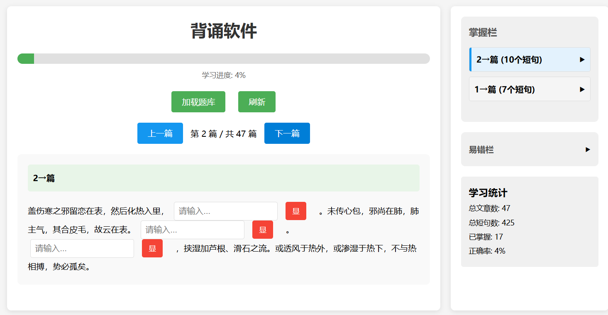

# 背诵软件

一个基于HTML、CSS和JavaScript开发的简洁高效的背诵学习软件。

## 界面展示



## 功能特点

- 📚 自动加载文本题库
- 🎯 智能生成挖空题目
- 📊 实时跟踪学习进度
- 📝 区分易错项和已掌握项
- 🔄 自动进入复习模式
- 🎨 支持个性化配置

## 快速开始

### 1. 启动本地服务器

```bash
# 使用 Python 启动简单 HTTP 服务器
python -m http.server 8080

# 或使用其他 HTTP 服务器
# http-server -p 8080
```

### 2. 访问应用

在浏览器中访问 `http://localhost:8080`

### 3. 开始学习

- 系统自动加载题库并生成题目
- 在输入框中填写答案，失去焦点后自动检查
- 查看右侧的掌握栏和易错栏
- 使用导航按钮切换文章

## 配置说明

通过 `config.json` 文件可以调整软件行为，包括：

- 题库文件名
- 挖空数量和比例
- 复习模式配置
- UI 显示选项

## 文件结构

```
.
├── index.html      # 主页面文件
├── script.js       # JavaScript 逻辑
├── config.json     # 配置文件
├── 背诵.txt       # 题库文件
└── README.md       # 说明文档
```

## 许可证

MIT License
